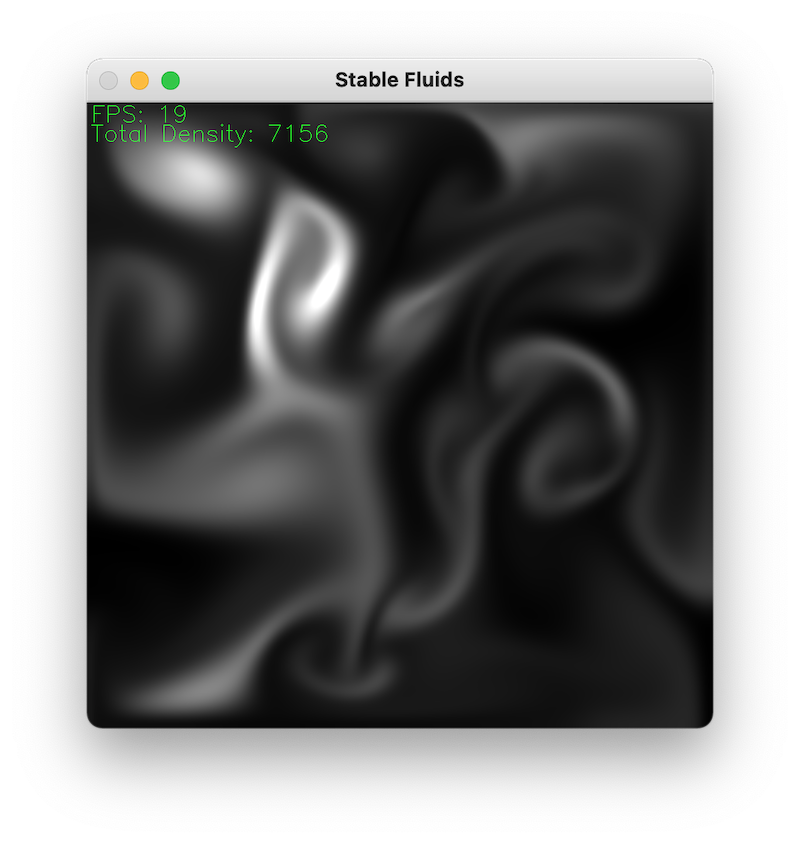

## Stable Fluids

Jos Stam's Navier-Stokes solver but written in Python (JAX) rather than C.

<p align="center">
  
</p>

<hr>

```
Stam, J., 2003, March. Real-time fluid dynamics for games. In Proceedings of the game developer conference (Vol. 18, p. 25).
```